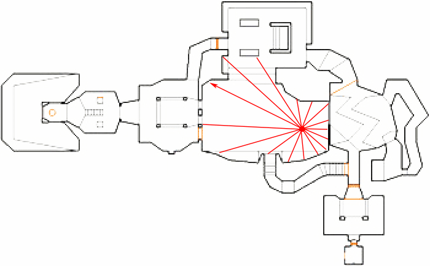
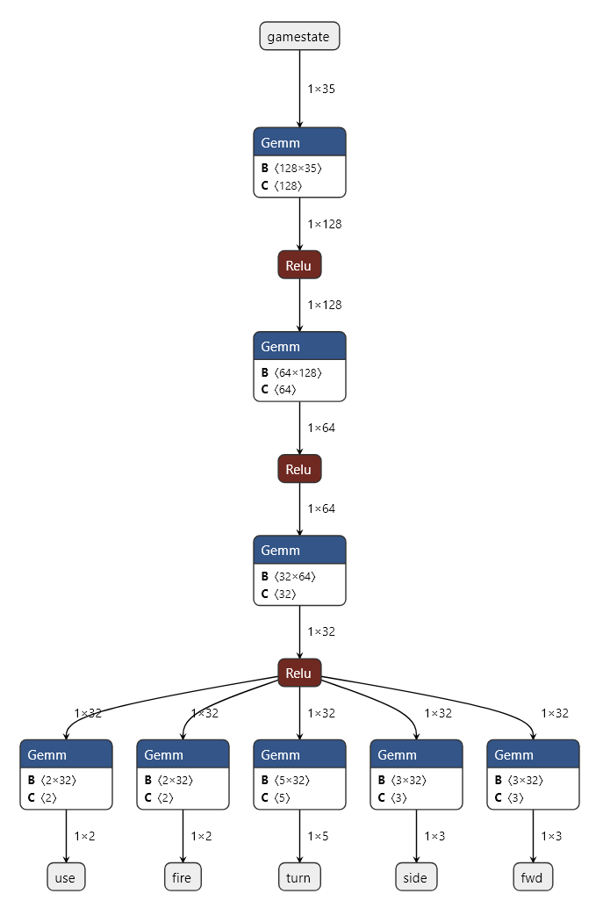

## Doom Bot Training Pipeline

This project trains a Multi-Head MLP to control a Doom bot for the
N64 engine (STM32 port). The model uses raycasting, player status,
and monster vectors as input.

### Setup Windows

```
python -m venv venv
venv\Scripts\activate.bat
pip install -r requirements.txt
```

### Setup Linux/macOS

```bash
python3 -m venv venv
source venv/bin/activate
pip install -r requirements.txt
```

### Starting Training

Place training data as `nn_training_*.csv` files in the `/data` folder.

The script loads all CSVs, normalizes the data, and exports an ONNX model.

```bash
python train_doom_bot.py --epochs 150 --data_dir ./data --output_dir ./output
```

Outputs after training:

 * `output/doom_bot.onnx`: The final model for STM32Cube AI Studio
 * `output/doom_bot.pth`: PyTorch checkpoint including scaler parameters and history.
 * `output/training_curves.png`: Visualization of loss and accuracy.

### Architecture & Features

The model is a Multi-Head MLP (35 Inputs -> 128 -> 64 -> 32 -> Heads).

#### Input (35 Features)

```
    Index   Feature     Description
    -----   -------     -----------
    0       angle       View direction [0, 1]
    1-4     player      Health, MomX, MomY, Weapon
    5-20    rays        16 distance rays (0..2048)
    21-29   monsters    3 monsters with [dx, dy, present] each
    30-34   last_act    Feedback from the last action (Fwd, Side, Turn, Fire, Use)
```


| Index | Group | Feature | Unit / Value Range | Description |
|:---:|:---|:---|:---|:---|
| **0** | Player | `angle` | `0.0` to `1.0` | View direction (0 to 2 pi) |
| **1** | Player | `health` | `0` to `200` | Current hit points |
| **2** | Player | `momx` | `~ -30.0` to `30.0` | Velocity in X (map units per tic) |
| **3** | Player | `momy` | `~ -30.0` to `30.0` | Velocity in Y (map units per tic) |
| **4** | Player | `weapon` | `0` to `8` | ID of the selected weapon (ReadyWeapon) |
| **5-20** | Rays | `ray0..15` | `0.0` to `2048.0` | 16 environment rays (map units) |
| **21** | Monster 0 | `m0_dx` | `~ -2048` to `2048` | Relative X distance (positive = forward) |
| **22** | Monster 0 | `m0_dy` | `~ -2048` to `2048` | Relative Y distance (positive = right) |
| **23** | Monster 0 | `m0_present` | `0.0` or `1.0` | 1.0 if monster slot is active |
| **24** | Monster 1 | `m1_dx` | `~ -2048` to `2048` | Relative X distance |
| **25** | Monster 1 | `m1_dy` | `~ -2048` to `2048` | Relative Y distance |
| **26** | Monster 1 | `m1_present` | `0.0` or `1.0` | 1.0 if monster slot is active |
| **27** | Monster 2 | `m2_dx` | `~ -2048` to `2048` | Relative X distance |
| **28** | Monster 2 | `m2_dy` | `~ -2048` to `2048` | Relative Y distance |
| **29** | Monster 2 | `m2_present` | `0.0` or `1.0` | 1.0 if monster slot is active |
| **30** | Last Act | `last_fwd` | `0, 1, 2` | 0: Backward, 1: Stop, 2: Forward |
| **31** | Last Act | `last_side` | `0, 1, 2` | 0: Right, 1: None, 2: Left |
| **32** | Last Act | `last_turn` | `0, 1, 2, 3, 4` | 0: Sharp R, 1: R, 2: Medium, 3: L, 4: Sharp L |
| **33** | Last Act | `last_fire` | `0.0` or `1.0` | 1.0 if fired in the last tic |
| **34** | Last Act | `last_use` | `0.0` or `1.0` | 1.0 if "Use" was active in the last tic |

*Important:* All values are additionally scaled in Python preprocessing before being fed into the network.
*Note:* The X/Y values are transformed into the player's coordinate system.

### Ray Casting

16 distance measurements are generated for the rays (index 5-20). Starting from the player's view direction, counter-clockwise. See video:

[](./doc/bsp_raycast.mp4)

#### Output

Type: Multi-Head MLP
Layers: 35 -> 128 -> 64 -> 32 -> [Heads]
Heads: Forward (3), Side (3), Turn (5), Fire (2), Use (2)

 * *Forward*: 3 classes (Backward, Stop, Forward)
 * *Side*: 3 classes (Right, None, Left)
 * *Turn*: 5 classes (Sharp Left to Sharp Right)
 * *Buttons*: Binary for Fire and Use

#### Example Output (Model Output)

The model outputs logits for each head. The highest value (argmax) wins.

Head: fwd (Forward/Backward)

    Logits: [-2.1, 0.5, 4.8]

    Result: Index 2 (Forward) -> The bot keeps moving forward.

Head: side (Strafing)

    Logits: [0.1, 3.2, -1.5]

    Result: Index 1 (None) -> The bot holds its course and does not strafe sideways.

Head: turn (Rotation)

    Logits: [-1.2, -0.5, 0.1, 3.5, 0.2]

    Result: Index 3 (Slight Right) -> The bot turns toward the monster.

Head: fire (Shooting)

    Logits: [-3.5, 4.2]

    Result: Index 1 (Yes) -> The bot fires.

Head: use (Open door)

    Logits: [5.2, -4.1]

    Result: Index 0 (No) -> The bot does not attempt to open a door.

The bot receives the outputs at every "tic" (35 times per second).
The output heads deliver indices (e.g. 0, 1, 2). These are mapped via static
lookup tables to the internal units of the Doom engine:

    Action              Class Indices       Mapping to Doom Units
    ------              -------------       ---------------------
    Forward (fwd)       0, 1, 2             {-25, 0, 25} (Walk/Run)
    Strafe (side)       0, 1, 2             {-20, 0, 20} (Strafing)
    Turn                0, 1, 2, 3, 4       {-512, -192, 0, 192, 512} (Precise to Sharp)
    Fire / Use          0, 1                `BT_ATTACK` / `BT_USE` (set bits)



### C Header Export (for direct C code)

```bash
python export_weights.py --checkpoint ./output/doom_bot.pth --output ./output/nn_weights.h
```
